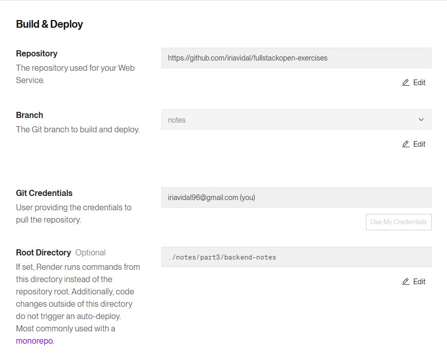
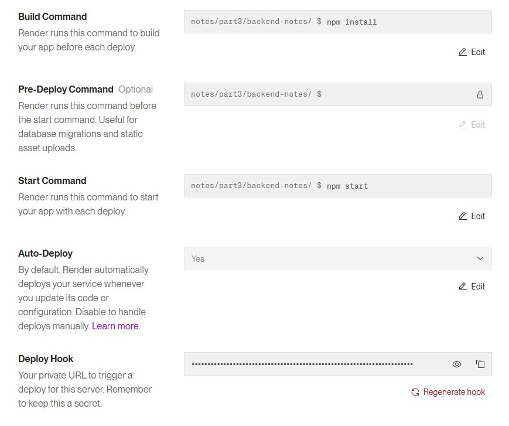
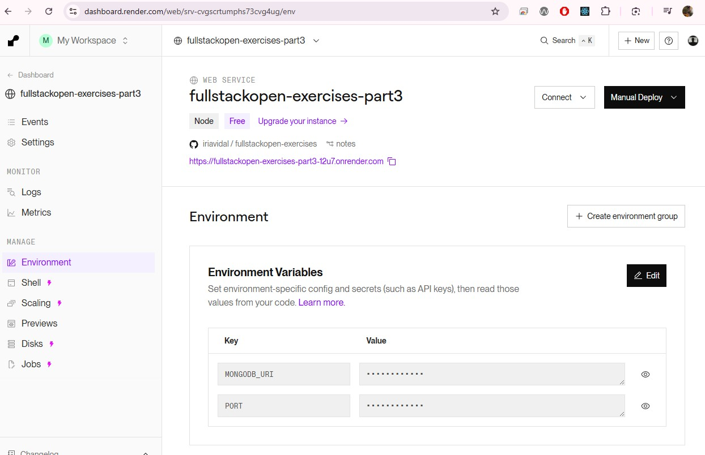

# Notas

## Índice

- [Cómo crear e iniciar un proyecto en React](#cómo-crear-e-iniciar-un-proyecto-en-react)
- [Componentes](#componentes)
- [JSX](#jsx)
- [`this` en JavaScript](#this-en-javascript)
- [Desestructuración en JavaScript](#desestructuración-en-javascript)
- [Por qué algunos elementos se guardan en estados y no en variables](#por-qué-algunos-elementos-se-guardan-en-estados-y-no-en-variables)
- [Hooks](#hooks)
- [Uso del Atributo `key` en React](#uso-del-atributo-key-en-react)
- [Acerca de los tipos de solicitudes HTTP](#acerca-de-los-tipos-de-solicitudes-http)
- [Política de mismo origen y CORS](#política-de-mismo-origen-y-cors)
- [dashboard.render.com - Configuración](#dashboardrendercom)
- [mongoose.set("strictQuery", false)](#mongoosesetstrictquery-false)
- [Qué es un esquema en Mongoose](#qué-es-un-esquema-en-mongoose)
- [Qué es Lodash](#qué-es-lodash)
  - [1. Agrupar elementos \_.groupBy](#1-agrupar-elementos-_groupby)
  - [2. Ordenar \_.sortBy](#2-ordenar-_sortby)
  - [3. Buscar máximos o mínimos _.maxBy y _.minBy](#3-buscar-máximosmínimos-_maxby-_minby)
  - [4. Filtrar y mapear](#4-filtrar-y-mapear)
- [Entorno de pruebas](#entorno-de-prueba)
- [Ejecución de pruebas individualmente](#ejecución-de-pruebas-individualmente)

## Cómo crear e iniciar un proyecto en React

> [Parte 1 -> a. Introducción a React](https://fullstackopen.com/es/part1/introduccion_a_react)

```bash
npm create vite@latest nombre-del-proyecto -- --template react

cd nombre-del-proyecto
npm install
npm run dev
```

## Componentes

> [Parte 1 -> a. Introducción a React -> Componente](https://fullstackopen.com/es/part1/introduccion_a_react#componente)

Un componente es una **función o clase JavaScript** que retorna elementos de React (usualmente JSX) para describir una parte de la UI. Su propósito es ser **reutilizable, independiente y encapsular lógica + vista**.

### 🔑 **Características clave vs Angular:**

| React                                         | Angular                                              |
| --------------------------------------------- | ---------------------------------------------------- |
| **Funcional** (con hooks) o **Clase**         | **Clases** decoradas con `@Component`                |
| Props (flujo unidireccional)                  | `@Input()` / `@Output()`                             |
| Estado gestionado con `useState`/`useReducer` | Gestión con propiedades de clase + `ChangeDetection` |
| **Sin inyección de dependencias automática**  | Inyección de dependencias integrada                  |

### 🧩 **Estructura Básica (Función):**

```jsx
// 1. Importar React (y hooks si son necesarios)
import React, { useState } from "react";
// 2. Definir el componente como función
const MiComponente = (props) => {
  // Lógica interna (estado, efectos, etc)
  const [contador, setContador] = useState(0);
  // 3. Retornar JSX (lo que se renderiza)
  return (
    <div>
      <h1>Hola, {props.nombre}</h1>
      <p>Contador: {contador}</p>
      <button onClick={() => setContador(contador + 1)}>Incrementar</button>
    </div>
  );
};
// 4. Exportar (para usarlo en otros lugares)
export default MiComponente;
```

### ⚙️ **Partes Fundamentales:**

1. **Props (Propiedades)**:

   - Datos que un componente **recibe desde su padre** (inmutables).
   - En React **no hay two-way binding por defecto** (como en Angular). Se usan funciones para comunicar cambios al padre.

   ```js
   const Hello = (props) => {
     console.log(props);
     return (
       <div>
         <p>
           Hello {props.name}, you are {props.age} years old
         </p>
       </div>
     );
   };

   const App = () => {
     const name = "Peter";
     const age = 10;

     return (
       <div>
         <h1>Greetings</h1>
         <Hello name="Maya" age={26 + 10} />
         <Hello name={name} age={age} />
       </div>
     );
   };
   ```

2. **Estado**:

- Datos que el componente **gestiona internamente** (usando `useState` o `useReducer`).
- Cuando cambia, React **vuelve a renderizar** el componente (y sus hijos necesarios).

3. **JSX**:

- Sintaxis similar a HTML que describe la UI.
- **¡No es HTML!** Es azúcar sintáctico para `React.createElement(...)`.

4. **Hooks** (como `useState`, `useEffect`):

- Permiten "enganchar" estado y ciclo de vida en **componentes funcionales** (después de React 16.8).

### ↔️ **Flujo de Datos:**

- **Unidireccional**: Padres → Hijos (vía props).
- **Comunicación entre componentes**:
- **Padre → Hijo**: Props.
- **Hijo → Padre**: Callbacks (pasados como props).
- **Hermanos/Global**: Context API o gestión de estado (Redux, Zustand).

## JSX

> [Parte 1 -> a. Introducción a React -> JSX](https://fullstackopen.com/es/part1/introduccion_a_react#jsx)

**JSX: JavaScript + XML (o HTML)**. Es una **extensión de sintaxis** que permite escribir "HTML" dentro de JavaScript. No es un string ni HTML real, sino una representación de elementos React.

### 🔍 Conceptos Clave:

1. **Naturaleza Fundamental**

```jsx
const elemento = <h1 className="titulo">Hola Mundo</h1>;
```

- **Se compila a**:

  `React.createElement('h1', { className: 'titulo' }, 'Hola Mundo')`

- **Output**: Objeto JavaScript que describe la UI (elemento React)

2. **Diferencias con Plantillas de Angular**
   | Característica | JSX (React) | Plantillas (Angular) |
   | ---------- | -------- | --------------|
   | **Lenguaje** | JavaScript (todo en .js/.jsx) | HTML con sintaxis propia |
   | **Directivas** | No existen (usas JS puro) | *ngIf, *ngFor, etc. |
   | **Scoping** | Todo está en mismo ámbito JS | Contexto propio de plantilla |
   | **Estilos** | `className`, `style={{ }}` | `class`, `[style]` |

### ⚙️ Reglas de Sintaxis Esenciales:

1.  **Embed JavaScript con `{ }`**

    ```jsx
    <h3>Hola, {usuario.nombre.toUpperCase()}</h3>
    ```

2.  **Atributos Diferentes a HTML**
    ```jsx
    <input
      type="text"
      className="mi-clase" // ≠ class (palabra reservada JS)
      htmlFor="input-id" // ≠ for (palabra reservada)
      style={{ color: "red" }} // Objeto JS (camelCase propiedades)
    />
    ```
3.  **Solo Un Elemento Raíz**

    ```jsx
    // ❌ Incorrecto
    return (
      <p>Párrafo 1</p>
      <p>Párrafo 2</p>
    );

    // ✅ Correcto (usar fragmentos <> o div)
    return (
      <>
       <p>Párrafo 1</p>
       <p>Párrafo 2</p>
      </>
    );
    ```

4.  **Listas Necesitan `key`**

    ```jsx
    {
      items.map((item) => <li key={item.id}>{item.nombre}</li>);
    }
    ```

### 🎯 Ejemplo Comparativo Angular → JSX:

```html
<!-- Angular -->
<div *ngIf="user">
  <h2 [class.active]="isActive">{{ user.name }}</h2>
</div>
```

```jsx
// React/JSX
{
  user && (
    <div>
      <h2 className={isActive ? "active" : ""}>{user.name}</h2>
    </div>
  );
}
```

## `this` en JavaScript

> [Parte 1 -> b. JavaScript -> Métodos de objeto y "this"](https://fullstackopen.com/es/part1/java_script#metodos-de-objeto-y-this)

- **Qué es**: Referencia dinámica al objeto "dueño" de una función.
- **Problema**: Cambia según cómo se llame la función.
  - `objeto.metodo()` → `this = objeto`
  - `const ref = objeto.metodo; ref()` → `this = global` (o undefined)
- **Soluciones**:
  1. `.bind(objeto)` - Fija `this` permanentemente.
  2. Arrow functions - Toman `this` del contexto exterior (útil en callbacks).
  3. Evitar en métodos de objetos literales.
- **En React**:
  - Componentes clase: Necesitaban `bind` en constructores.
  - Componentes función (Hooks): ¡No usan `this`!

## Desestructuración en JavaScript

> [Parte 1 -> c. Estado del componente, controladores de eventos -> Desestructuración](https://fullstackopen.com/es/part1/estado_del_componente_controladores_de_eventos#desestructuracion)

La desestructuración es un **atajo sintáctico** para extraer valores de **arrays** o propiedades de **objetos** y asignarlos a variables individuales de forma rápida.

### 🔑 Con Objetos:

Extrae propiedades por nombre.

```javascript
const persona = { nombre: "Ana", edad: 30, pais: "España" };

// ⚡ Forma tradicional (verbose)
const nombre = persona.nombre;
const edad = persona.edad;

// ✅ Con desestructuración (compacto)
const { nombre, edad } = persona;

console.log(nombre); // 'Ana'
console.log(edad); // 30
```

- **Renombrar variables**:

  `const { nombre: primerNombre } = persona;`

- **Valores por defecto**:

  `const { mascota = 'No tiene' } = persona;`

### 🔢 Con Arrays:

Extrae elementos por posición.

```javascript
const colores = ["rojo", "verde", "azul"];

// ⚡ Forma tradicional
const primerColor = colores[0];

// ✅ Con desestructuración
const [primer, segundo] = colores;

console.log(primer); // 'rojo'
console.log(segundo); // 'verde'
```

- **Saltar elementos**:

`const [ , , tercero] = colores; // 'azul'`

- **Valores por defecto**:

`const [primero, segundo, tercero, cuarto = 'negro'] = colores;`

### 💡 Usos Comunes en React:

1. **Props en componentes**:

```jsx
const MiComponente = ({ titulo, onClick }) => {
  return <button onClick={onClick}>{titulo}</button>;
};
```

2. **Importar módulos**:

```javascript
import { useState, useEffect } from "react";
```

3. **Manejar respuestas API**:

```javascript
fetch("/api/data").then(({ data, status }) => {
  /* ... */
});
```

## Por qué algunos elementos se guardan en estados y no en variables

> [Parte 1 -> c. Estado del componente, controladores de eventos -> Componente con estado](https://fullstackopen.com/es/part1/estado_del_componente_controladores_de_eventos#componente-con-estado)

En React, los datos que afectan a la interfaz de usuario (como las notas en esta aplicación) deben almacenarse en un estado en lugar de en una variable normal.

### 1. React NO detecta cambios en variables normales

Si guardas las notas en una variable normal, React no se dará cuenta cuando cambien, porque React solo vuelve a renderizar un componente cuando un estado o una prop cambia.

Ejemplo:

```js
let notes = []; // Variable normal

const addNote = () => {
  notes.push({ content: "Nueva nota", important: false });
  console.log(notes); // Se actualiza el array en la consola
};
```

**Problema**: aunque la variable `notes` cambia, React no se entera y la interfaz no se actualiza.

### 2. El estado fuerza un nuevo renderizado

Cuando usas `useState`, React **sabe que los datos cambiaron** y vuelve a renderizar el componente con la nueva información.
Ejemplo:

```js
const [notes, setNotes] = useState([]);

const addNote = () => {
  const newNote = { content: "Nueva nota", important: false };
  setNotes(notes.concat(newNote)); // React detecta el cambio y re-renderiza
};
```

**Ventaja**: cuando llamas `setNotes`, React actualiza la interfaz automáticamente.

### 3. React recuerda el estado entre renders

Las variables normales se reinician en cada renderizado, mientras que el estado se mantiene.
Ejemplo de variable normal:

```js
let notes = []; // Se vacía cada vez que se renderiza el componente

const addNote = () => {
  notes.push("Nueva nota");
};
```

Cada vez que el componente se renderiza, la variable `notes` se vuelve a definir como un array vacío. Por eso los datos desaparecen.

Solución:

```js
const [notes, setNotes] = useState([]); // Se mantiene entre renders
```

Ahora, aunque el componente se vuelva a renderizar, el estado recuerda las notas.

### 4. El estado es reactivo

El estado también permite que otros efectos (como `useEffect`) respondan a los cambios. Por ejemplo, si las notas cambian, podrías guardar automáticamente en el servidor o hacer animaciones.

```js
useEffect(() => {
  console.log("El estado de notas cambió:", notes);
}, [notes]); // Se ejecuta cada vez que las notas cambian
```

## Hooks

> [Parte 1 -> d. Un estado más complejo, depurando aplicaciones React -> Reglas de los Hooks](https://fullstackopen.com/es/part1/un_estado_mas_complejo_depurando_aplicaciones_react#reglas-de-los-hooks)

**Qué son**: Funciones especiales que permiten "enganchar" funcionalidades de React (como estado y ciclo de vida) en **componentes funcionales**. Introducidos en React 16.8 (2019).

### 🧩 Principales Hooks

1. **`useState`**

   - Maneja **estado local** en componentes funcionales
   - Retorna: [valor, funciónParaActualizar]
   - Reemplaza `this.setState` de componentes clase

   ```jsx
   import { useState } from "react";

   function Contador() {
     const [count, setCount] = useState(0); // Valor inicial 0

     return (
       <div>
         <p>Contador: {count}</p>
         <button onClick={() => setCount(count + 1)}>Incrementar</button>
       </div>
     );
   }
   ```

2. **`useEffect`**

   - Maneja **efectos secundarios** (peticiones API, suscripciones, manipulación DOM)
   - Equivale a `componentDidMount`, `componentDidUpdate` y `componentWillUnmount` combinados
   - Control de ejecución con array de dependencias

   ```jsx
   import { useState, useEffect } from "react";

   function Usuario() {
     const [user, setUser] = useState(null);

     // Equivalente a componentDidMount
     useEffect(() => {
       fetch("/api/user")
         .then((res) => res.json())
         .then((data) => setUser(data));
     }, []); // Array vacío = solo al montar

     // Actualiza título cuando user cambia
     useEffect(() => {
       document.title = user ? user.name : "Cargando...";
     }, [user]); // Se ejecuta cuando user cambia

     return <div>{user?.name || "Cargando..."}</div>;
   }
   ```

3. **`useContext`**

   - Accede al valor de un **contexto** React sin componente proveedor anidado
   - Solución elegante para evitar "prop drilling"

   ```jsx
   import { createContext, useContext } from "react";

   // 1. Crear contexto
   const TemaContext = createContext("claro");

   function App() {
     return (
       // 2. Proveer valor
       <TemaContext.Provider value="oscuro">
         <Toolbar />
       </TemaContext.Provider>
     );
   }

   function Toolbar() {
     // 3. Consumir valor
     const tema = useContext(TemaContext);
     return (
       <div style={{ background: tema === "oscuro" ? "#333" : "#FFF" }}>
         Tema Actual: {tema}
       </div>
     );
   }
   ```

### ⚙️ Otros Hooks Importantes

- **`useRef`**:  
  Crea referencias mutables a elementos DOM o valores persistentes entre renders

  ```jsx
  import { useRef, useEffect } from "react";

  function InputFocus() {
    const inputRef = useRef(null);

    useEffect(() => {
      // Enfocar input al montar
      inputRef.current.focus();
    }, []);

    return <input ref={inputRef} type="text" />;
  }
  ```

- **`useReducer`**:  
  Alternativa a `useState` para manejar lógica de estado compleja (estilo Redux)

  ```jsx
  import { useReducer } from "react";

  // Reducer function
  function contadorReducer(state, action) {
    switch (action.type) {
      case "incrementar":
        return { count: state.count + 1 };
      case "decrementar":
        return { count: state.count - 1 };
      default:
        throw new Error();
    }
  }

  function Contador() {
    const [state, dispatch] = useReducer(contadorReducer, { count: 0 });

    return (
      <div>
        <p>Count: {state.count}</p>
        <button onClick={() => dispatch({ type: "incrementar" })}>+</button>
        <button onClick={() => dispatch({ type: "decrementar" })}>-</button>
      </div>
    );
  }
  ```

- **`useMemo`** y **`useCallback`**:  
   Optimizan rendimiento memoizando valores y funciones.

  **📝 Nota Clave**:  
  Los hooks de memoización (`useMemo`, `useCallback`) deben usarse solo cuando son necesarios para optimizar rendimiento en componentes con renders costosos.

### 📜 Reglas Fundamentales

1. **Solo llamar Hooks en el nivel superior**
   - Nunca dentro de bucles, condicionales o funciones anidadas
2. **Solo llamar Hooks desde:**
   - Componentes funcionales de React
   - Custom Hooks (tus propios hooks)

### 💡 Por qué son Revolucionarios

- **Simplifican componentes**: Eliminan complejidad de clases (`this`, constructores)
- **Reutilización de lógica**: Custom Hooks permiten compartir lógica entre componentes
- **Código más organizado**: Agrupan funcionalidad relacionada (ej: datos + carga)
- **Adopción masiva**: Estándar actual en nuevos proyectos React

## Uso del Atributo `key` en React

> [Parte 2 -> a. Renderizando una colección, módulos -> Atributo key](https://fullstackopen.com/es/part2/renderizando_una_coleccion_modulos#atributo-key)

El atributo `key` es un identificador especial que ayuda a React a **diferenciar componentes hermanos** en una lista. Es una propiedad obligatoria al renderizar arrays de elementos.

### ❗ **Por qué es necesario**

1. **Identificación única**:  
   React usa las `keys` para reconocer qué elementos han cambiado, se han añadido o eliminado.
2. **Optimización de rendimiento**:  
   Permite a React actualizar solo los elementos modificados en lugar de re-renderizar toda la lista.

3. **Mantenimiento del estado**:  
   Evita errores al preservar el estado interno de componentes (como inputs) durante re-renders.

### ⚠️ **Consecuencias de omitirlo**

- Advertencia en consola: _"Warning: Each child in a list should have a unique key prop"_
- Comportamiento errático en interfaces (estados de componentes que "saltan" entre elementos)
- Pérdida de rendimiento al re-renderizar toda la lista innecesariamente

### ✅ **Buenas prácticas**

1. **Usar datos únicos y estables** como:

   - IDs de base de datos (ideal)
   - Valores criptográficos (UUIDs)

   ```jsx
   {
     items.map((item) => (
       <li key={item.id}>{item.name}</li> // ✔️ ID único
     ));
   }
   ```

2. **Evitar como key**:

   - Índices del array (solo si no hay alternativa)

   - Valores aleatorios (generados en render)

   ```jsx
   // ❌ Evitar
   {
     items.map((item, index) => <li key={index}>{item.name}</li>);
   }
   ```

3. **Reglas clave**:

   - Deben ser **únicas** entre hermanos

   - Deben ser **consistentes** entre renders

   - No necesitan ser globalmente únicas

### 🌐 Casos especiales

- **Componentes sin lista**: No requieren `key`

- **Fragmentos**: No aceptan atributos `key` (usar en elementos hijos)

- **Reordenamientos dinámicos**: Claves estables previenen recreación de componentes

### 💡 Por qué importa

Las `keys` son fundamentales para:

- Mantener el rendimiento óptimo en listas grandes

- Garantizar un comportamiento predecible en interfaces dinámicas

- Evitar bugs sutiles en formularios y estados complejos

## Acerca de los tipos de solicitudes HTTP

> [Parte 3 -> a. Node.js y Express -> Acerca de los tipos de solicitudes HTTP](https://fullstackopen.com/es/part3/node_js_y_express#acerca-de-los-tipos-de-solicitudes-http)

El estándar HTTP define dos propiedades importantes para las solicitudes: **seguridad** e **idempotencia**.

1. **Seguridad (GET y HEAD)**: Las solicitudes GET y HEAD deben ser seguras, lo que significa que no deben cambiar nada en el servidor, solo obtener datos. En otras palabras, una solicitud GET no debería alterar el estado de la base de datos ni generar efectos secundarios.

2. **Idempotencia (GET, HEAD, PUT, DELETE)**: Las solicitudes GET, HEAD, PUT y DELETE deben ser idempotentes. Esto significa que enviar la misma solicitud varias veces debe dar el mismo resultado, sin importar cuántas veces se repita. Por ejemplo, si se hace una solicitud PUT varias veces con los mismos datos, el resultado será el mismo.

3. **POST**: Es la única solicitud que no es ni segura ni idempotente. Si se envía varias veces, por ejemplo, añadiendo la misma nota, cada solicitud creará una nueva entrada, lo que puede cambiar el estado del servidor.

En resumen, GET y HEAD deben ser seguros (sin efectos secundarios), mientras que GET, HEAD, PUT y DELETE deben ser idempotentes (con el mismo resultado sin importar cuántas veces se realicen). POST es el único que no sigue estas reglas.

## Middleware en Express

> [Parte 3 -> a. Node.js y Express -> Middleware](https://fullstackopen.com/es/part3/node_js_y_express#middleware)

Un middleware es una **función intermedia** que procesa objetos `request` y `response` en Express. Actúa como un "puente" entre la solicitud entrante y la respuesta final.

---

### ⚙️ **Funcionamiento Básico**

```javascript
const middleware = (request, response, next) => {
  // 1. Procesa la solicitud (ej: leer datos)
  // 2. Modifica request/response (opcional)
  next(); // 3. Pasa el control al siguiente middleware
};
```

### 🛠️ Características Clave

1. **Encadenamiento**:

   Se ejecutan en **orden secuencial** según se definen con `app.use()`.

   ```javascript
   app.use(middleware1);
   app.use(middleware2); // Se ejecuta después de middleware1
   ```

2. **Acceso completo**:

   Pueden leer/modificar `request` (ej: añadir `request.body`) y `response`.

3. **Control de flujo**:

   La función `next()` cede el control al siguiente middleware en la cadena.

### 📌 Ejemplos del Curso

1. `json-parser`:

   Convierte el cuerpo de la solicitud (raw) → Objeto JavaScript en `request.body`.

   ```javascript
   // Sin json-parser
   app.post("/api/notes", (req, res) => {
     console.log(req.body); // => undefined!
   });

   // Con json-parser
   app.use(express.json()); // Middleware mágico ✨

   app.post("/api/notes", (req, res) => {
     console.log(req.body); // => { title: "Comprar leche", important: true }
   });
   ```

   - 🛠️ Proceso interno paso a paso:
     1. **Intercepta solicitudes** con cabecera `Content-Type: application/json`
     2. **Lee los datos** brutos del cuerpo de la solicitud
     3. **Convierte** el JSON en objeto JavaScript
     4. **Asigna el resultado** a `request.body`
     5. **Pasa el control** al siguiente middleware (`next()`)

2. `requestLogger`:

   Registra detalles de cada solicitud:

   ```javascript
   const requestLogger = (req, res, next) => {
     console.log("Method:", req.method);
     console.log("Path: ", req.path);
     console.log("Body: ", req.body);
     next();
   };
   ```

3. **Manejo de errores (404)**:

   Se define **después de las rutas** para capturar solicitudes no manejadas:

   ```javascript
   const unknownEndpoint = (req, res) => {
     res.status(404).send({ error: "unknown endpoint" });
   };
   ```

### ⚠️ ¡Orden Crítico!

El orden de declaración determina:

- **Dependencias**:

  Si un middleware necesita `request.body` (creado por `json-parser`), debe definirse **después**.

- **Ubicación estratégica**:

  - _Antes de rutas_: Ejecución en todas las solicitudes.

  - _Después de rutas_: Solo para solicitudes no manejadas (ej: 404).

> **Conclusión**: Los middleware son como estaciones de procesamiento en una cadena de montaje, donde cada uno transforma la solicitud antes de llegar al controlador final.

## Política de mismo origen y CORS

> [Parte 3 -> b. Despliegue de la aplicación a Internet -> Política de mismo origen y CORS](https://fullstackopen.com/es/part3/despliegue_de_la_aplicacion_a_internet#politica-de-mismo-origen-y-cors)

Para conectar el frontend al backend, cambiamos la URL en el archivo `notes.js` para que las notas se obtengan desde `http://localhost:3001/api/notes`. Sin embargo, la solicitud GET falla debido a la **política de mismo origen (Same-Origin Policy)**, una restricción de seguridad de los navegadores que impide que una web cargue recursos desde un servidor con un origen diferente (protocolo, host o puerto distinto).

Para solucionar esto, usamos CORS (Cross-Origin Resource Sharing), un mecanismo que permite solicitudes entre distintos orígenes. En nuestro backend, instalamos y configuramos el middleware CORS con:

```js
const cors = require("cors");
app.use(cors());
```

Esto permite que el frontend en `localhost:5173/` pueda comunicarse con el backend en `localhost:3001`. Ahora el frontend puede obtener las notas correctamente, aunque algunas funcionalidades aún no están implementadas en el backend.

## dashboard.render.com

> [Parte 3 -> b. Despliegue de la aplicación a Internet -> Aplicación a Internet](https://fullstackopen.com/es/part3/despliegue_de_la_aplicacion_a_internet#aplicacion-a-internet)

### Configuración




## mongoose.set("strictQuery", false);

Esta línea de código en Mongoose desactiva el **modo de consulta estricta** (strictQuery).

### ¿Qué es `strictQuery` en Mongoose?

Mongoose permite realizar consultas en la base de datos utilizando objetos con diferentes propiedades. Sin embargo, cuando `strictQuery` está habilitado (`true`), Mongoose solo permite consultar utilizando propiedades que estén definidas en el esquema.

Si se establece en `false`, Mongoose permite realizar consultas con propiedades que no están definidas en el esquema, aunque la base de datos puede no devolver resultados.

#### Ejemplo con `strictQuery: true` (Modo Estricto)

Supongamos que tenemos un esquema en Mongoose para una colección de usuarios:

```js
const userSchema = new mongoose.Schema({
  name: String,
  age: Number,
});

const User = mongoose.model("User", userSchema);
```

Si intentamos hacer una consulta con una propiedad no definida en el esquema:

```js
User.find({ email: "test@example.com" })
  .then((result) => console.log(result))
  .catch((error) => console.error(error));
```

Con strictQuery activado (true), Mongoose ignorará la propiedad email porque no está definida en el esquema, y la consulta se traducirá a:

```js
User.find({}); // Devuelve todos los usuarios
```

Lo que significa que la consulta no filtrará nada y devolverá todos los documentos en la colección.

#### Ejemplo con `strictQuery: false` (Modo Flexible)

Si en cambio desactivamos `strictQuery` con:

```js
mongoose.set("strictQuery", false);
```

Mongoose **no ignorará** la consulta con `email`, sino que la enviará a MongoDB tal como está:

```js
User.find({ email: "test@example.com" });
```

En este caso, MongoDB intentará buscar documentos que tengan la propiedad `email`. Si bien en la mayoría de los casos no devolverá resultados (porque `email` no está en el esquema), en algunos casos puede funcionar si en la base de datos ya existen documentos que tienen esta propiedad de alguna manera.

## Qué es un esquema en Mongoose

Un **esquema** en Mongoose es una estructura que define la forma que tendrán los documentos dentro de una colección de MongoDB. Es como un "molde" o "plantilla" que indica qué propiedades tendrá cada documento, qué tipo de datos pueden almacenar y si deben cumplir ciertas reglas o restricciones. Ejemplo:

```js
const noteSchema = new mongoose.Schema({
  content: String,
  important: Boolean,
});
```

## Cómo añadir las variables del archivo .env en Render



## Qué es Lodash

**Lodash** es una librería de utilidades para JavaScript que facilita trabajar con arrays, objetos, strings, etc. Ayuda a escribir código más limpio y conciso, especialmente cuando se hacen cosas como:

- Agrupar elementos (`_.groupBy`)
- Ordenar (`_.sortBy`)
- Buscar máximos/mínimos (`_.maxBy`, `_.minBy`)
- Filtrar y mapear
- Clonar y comparar objetos
- Operaciones complejas con arrays de objetos

👉 Se instala con:

```bash
npm install lodash
```

👉 Y se usa así:

```js
const _ = require("lodash");
```

### 1. Agrupar elementos (`_.groupBy`)

```js
const _ = require("lodash");

const users = [
  { name: "Alice", role: "admin" },
  { name: "Bob", role: "user" },
  { name: "Charlie", role: "admin" },
  { name: "David", role: "user" },
];

const grouped = _.groupBy(users, "role");

console.log(grouped);
```

**Explicación:**

- `_.groupBy` agrupa los elementos del array por el valor de una propiedad.

- En este caso, agrupa por role, así que obtendrás:

```js
{
  admin: [
    { name: 'Alice', role: 'admin' },
    { name: 'Charlie', role: 'admin' }
  ],
  user: [
    { name: 'Bob', role: 'user' },
    { name: 'David', role: 'user' }
  ]
}
```

### 2. Ordenar (`_.sortBy`)

```js
const items = [
  { name: "Apple", price: 3 },
  { name: "Banana", price: 1 },
  { name: "Orange", price: 2 },
];

const sorted = _.sortBy(items, "price");

console.log(sorted);
```

**Explicación:**

- `_.sortBy` ordena los objetos del array por la propiedad indicada (price).

- Devuelve un nuevo array ordenado de menor a mayor:

```js
[
  { name: "Banana", price: 1 },
  { name: "Orange", price: 2 },
  { name: "Apple", price: 3 },
];
```

### 3. Buscar máximos/mínimos (_.maxBy, _.minBy)

```js
const products = [
  { name: "Laptop", price: 1200 },
  { name: "Phone", price: 800 },
  { name: "Tablet", price: 600 },
];

const mostExpensive = _.maxBy(products, "price");
const cheapest = _.minBy(products, "price");

console.log(mostExpensive); // Laptop
console.log(cheapest); // Tablet
```

**Explicación:**

- `_.maxBy` devuelve el objeto con el valor máximo en la propiedad especificada.

- `_.minBy` hace lo mismo pero con el valor mínimo.

### 4. Filtrar y mapear

```js
const books = [
  { title: "Book A", year: 1999 },
  { title: "Book B", year: 2010 },
  { title: "Book C", year: 2020 },
];

// Filtrar libros publicados después de 2000
const recentBooks = _.filter(books, (book) => book.year > 2000);

// Obtener solo los títulos
const titles = _.map(recentBooks, "title");

console.log(titles); // ['Book B', 'Book C']
```

**Explicación:**

- `_.filter` devuelve los objetos que cumplen una condición.

- `_.map` transforma cada objeto, extrayendo una propiedad o aplicando una función.

### 5. Clonar y comparar objetos

```js
const original = { name: "Anna", age: 25 };

// Clonar objeto
const clone = _.cloneDeep(original);

// Comparar si tienen el mismo contenido
console.log(_.isEqual(original, clone)); // true

// Comparar referencias
console.log(original === clone); // false (porque son objetos distintos)
```

**Explicación:**

- `_.cloneDeep` crea una copia profunda del objeto.

- `_.isEqual` compara dos objetos para ver si su contenido es idéntico.

### 6. Operaciones complejas con arrays de objetos

```js
const posts = [
  { author: "Alice", likes: 5 },
  { author: "Bob", likes: 10 },
  { author: "Alice", likes: 3 },
  { author: "Bob", likes: 7 },
];

// Total likes por autor
const grouped = _.groupBy(posts, "author");
const likesPerAuthor = _.map(grouped, (posts, author) => {
  return {
    author,
    totalLikes: _.sumBy(posts, "likes"),
  };
});

console.log(likesPerAuthor);
```

**Explicación:**

1. Agrupamos los posts por author con `_.groupBy`.

2. Luego, para cada grupo, usamos `_.sumBy` para sumar los likes.

3. El resultado será un array con los autores y el total de likes de cada uno:

```js
[
  { author: "Alice", totalLikes: 8 },
  { author: "Bob", totalLikes: 17 },
];
```

## Entorno de prueba

### ¿Qué es el entorno de prueba y para qué sirve?

Cuando creamos una aplicación con Node.js, esta puede comportarse de forma diferente según el entorno en el que se esté ejecutando:

. **Producción:** Cuando la app está en un servidor real (por ejemplo, en Fly.io o Render).

- **Desarrollo:** Cuando estás programando en tu ordenador.

- **Pruebas:** Cuando ejecutas tests para comprobar que tu código funciona correctamente.

### ¿Cómo se cambia el entorno?

Node.js permite establecer una variable llamada `NODE_ENV` que indica en qué modo está la app. Podemos usarla para que el código haga cosas diferentes dependiendo del entorno.

Por ejemplo, podemos usar diferentes bases de datos:

- Una para desarrollo.

- Otra para producción.

- Otra distinta para hacer pruebas, sin dañar los datos reales.

### ¿Dónde se pone NODE_ENV?

Lo más habitual es definirlo en los scripts del archivo `package.json`:

```json
"scripts": {
  "start": "NODE_ENV=production node index.js",
  "dev": "NODE_ENV=development nodemon index.js",
  "test": "NODE_ENV=test node --test"
}
```

Esto significa:

- `npm start`: ejecuta la app en modo **producción**.

- `npm run dev`: ejecuta la app en modo **desarrollo** con recarga automática.

- `npm test`: ejecuta los tests en modo **test**.

### ¿Cuál es el problema en Windows?

Los scripts como `"NODE_ENV=production node index.js"` funcionan bien en **Linux y Mac**, pero en **Windows fallan** porque el sistema no entiende esa sintaxis.

### ¿Cuál es la solución?

Instalar un paquete que se llama `cross-env`, que hace que esto funcione igual en todos los sistemas operativos (Windows, Mac y Linux).

1. Para desarrollo:

```bash
npm install --save-dev cross-env
```

2. Si quieres que también funcione al subirlo a producción (por ejemplo en Fly.io), instálalo así:

```bash
npm install cross-env
```

### Actualizar los scripts con cross-env

Cambia tus scripts en `package.json` para usar `cross-env`:

```json
"scripts": {
  "start": "cross-env NODE_ENV=production node index.js",
  "dev": "cross-env NODE_ENV=development nodemon index.js",
  "test": "cross-env NODE_ENV=test node --test"
}
```

Ahora funciona igual en **todos los sistemas**.

### ¿Por qué es útil todo esto?

Porque nos permite tener comportamientos distintos según el entorno. Por ejemplo:

- Cargar **datos reales** en producción.

- Usar una **base de datos** de pruebas al ejecutar `npm test`.

- Usar datos falsos o mostrar logs más detallados en desarrollo.

## Ejecución de pruebas individualmente

Por defecto, el comando:

```bash
npm test
```

ejecuta **todas las pruebas** de la aplicación. Sin embargo, durante el desarrollo es útil ejecutar solo una o algunas pruebas concretas.

### Opción 1: `test.only`

Puedes marcar pruebas individuales para que **solo se ejecuten ésas**:

```js
test.only("notes are returned as json", async () => {
  // ...
});

test.only("there are two notes", async () => {
  // ...
});
```

Para que esto funcione, debes ejecutar el comando con la opción `--test-only`, **asegurándote de pasar dos guiones** (`--`):

```bash
npm run test -- -- --test-only
```

> ⚠️ ¡Cuidado! No olvides quitar `.only` al finalizar, o podrías dejar fuera pruebas importantes sin darte cuenta.

### Opción 2: Ejecutar un archivo de pruebas específico

Puedes correr solo un archivo de pruebas concreto, por ejemplo:

```bash
npm test -- tests/note_api.test.js
```

### Opción 3: Filtrar pruebas por nombre

Si quieres ejecutar pruebas que contengan una palabra o frase específica en su nombre:

```bash
npm run test -- -- --test-name-pattern="notes"
```

También puedes usar partes del nombre, y funciona tanto con los títulos de `test()` como los de `describe()`.

```

```

```

```
